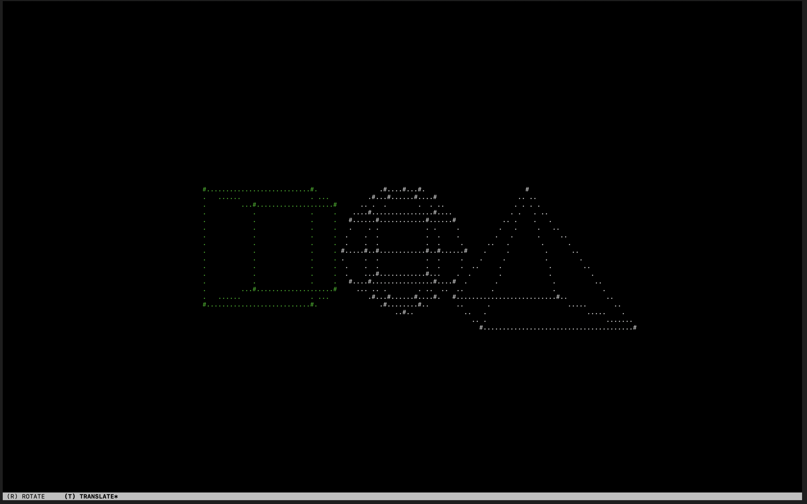

# Terminal 3D Engine

A terminal-based 3D wireframe renderer built in C using ncurses. Render and manipulate 3D primitives in ASCII art directly in your terminal.



## Features

- **3D Primitives**: Cube, sphere (parametric), and pyramid
- **Real-time Transformations**: Rotate and translate shapes on all axes
- **Perspective Projection**: Proper 3D to 2D projection with depth
- **Interactive Controls**: Vim-style keybindings for manipulation

## Building

```bash
make
```

Requires `ncurses` library.

## Usage

```bash
./3dengine
```

### Controls

| Key | Action |
|-----|--------|
| `i/k` | Move up/down (translate) or rotate on X-axis |
| `j/l` | Move left/right (translate) or rotate on Y-axis |
| `q/d` | Move forward/back (translate) or rotate on Z-axis |
| `T` | Switch to translate mode |
| `R` | Switch to rotate mode |
| `←/→` | Select previous/next shape |
| `e` | Exit |

## Project Structure

```
├── main.c        # Entry point and input handling
├── shape.c/h     # 3D primitive generation (cube, sphere, pyramid)
├── transform.c/h # Rotation and translation operations
├── render.c/h    # Projection and ncurses rendering
├── scene.c/h     # Scene and shape management
├── types.h       # Core data structures
└── constants.h   # Configuration values
```

## License

MIT
